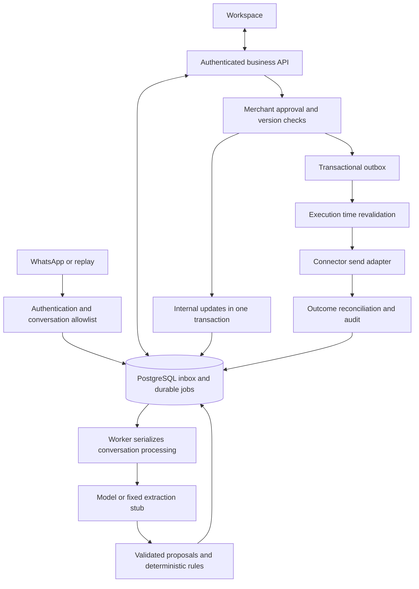

# Architecture baseline

See [ADR 0001](adr/0001-foundation.md), [ADR 0002](adr/0002-contract-authority.md) and [ADR 0003](adr/0003-approval-and-execution.md).

## Deployment and data flow

Use one repository, a modular API backend, a separate worker sharing business code, and PostgreSQL. Model and connector providers sit behind adapters. The frontend never calls connector administration endpoints.

Replay ingestion, durable worker, fixed extraction stub, internal confirmation, calendar/task updates and audit are implemented. The external connector/model/outbox/send branch remains target architecture. PostgreSQL is the Compose runtime; SQLite is only a test fallback.

## Modules

| Module | Owns | Boundary |
| --- | --- | --- |
| identity | Authentication, consent, allowlists | Trusted account context |
| messaging | Sessions, normalized events, messages | Accepted context revisions and source references |
| understanding | Assignment candidates, extraction, drafts | Proposals only; no confirmed writes or external tools |
| workorders | Work orders, changes, confirmation history | Versioned domain commands |
| planning | Tasks, internal calendar, conflicts | Computed availability and approved formal writes |
| actions | Approval snapshots, invalidation, outbox, reconciliation | Only external-write gateway |
| audit | Actors, traces, deletion coverage | Traceability without full content in logs |

Initial services are responsibility-named Python files under apps/backend/src/gigmate; split into packages when they grow. Do not create unused module packages. Services share deterministic rules. Schedule confirmation is implemented; other domain commands and external actions remain pending. Any team member may contribute to any module. Rotating module contacts coordinate interfaces and handoffs, with no exclusive approval rights; see [equal collaboration](team-governance.md).

## Data and reliability

Account owns consent, conversations, messages, work orders and actions. Conversations and work orders have explicit many-to-many associations. Changes reference message revisions; tasks/calendar reference confirmed work-order revisions. Actions retain immutable snapshots. Separate deadlines, timed intervals and tentative arrangements. See [domain schema](../../contracts/domain/models.schema.json).

1. Authenticate and allowlist before storing business content. Persist accepted events, advance context, and create jobs atomically; acknowledge only after commit.
2. Event deduplication differs from message identity. Creation, edits, revocations and acknowledgments cannot share one collapsing unique key. Verify provider mapping for the chosen engine.
3. Serialize conversation interpretation; use expected work-order/context versions on writes. Delayed events need reconciliation rather than arrival-time overwrites.
4. Commit internal work-order, task, calendar and reminder changes together, retaining sources and old/new values.
5. Commit approved actions and outbox jobs together. Workers use bounded leases, attempts and crash recovery. Ambiguous external outcomes require reconciliation.
6. Serialize accepted inbound changes against final pre-dispatch version checks. The local guarantee cannot cover remote messages not yet delivered by the connector; measure and disclose that boundary.
7. Own API send echoes update context without producing a reply loop or retroactively cancelling a dispatched send. Later queued actions still require current context.

## Adapters and security

Record capabilities for text, edits, revocations, acknowledgments, lookup and reconnect recovery. Fix WAHA version/engine after testing; unsupported features remain explicit. Do not promise seamless migration to official access. See [events](https://waha.devlike.pro/docs/how-to/events/) and [disclaimer](https://waha.devlike.pro/docs/overview/introduction/).

Models receive bounded, allowlisted context and emit sourced proposals. Validate structure, ownership, identifiers, sources and dates. Record model/prompt/schema versions. Server code computes conflicts and executes approved actions.

Enforce ownership on every query and mutation. Keep connector credentials private and validate supported webhook authentication/signatures; see [WAHA security](https://waha.devlike.pro/docs/how-to/security/). Logs contain IDs, stage, latency and stable error codes, never complete messages, addresses, tokens or QR material. Revoked consent or disconnection blocks external execution. Deletion must cover data and queued jobs; proposed prototype raw-message retention is 30 days and must be implemented before real trials.
