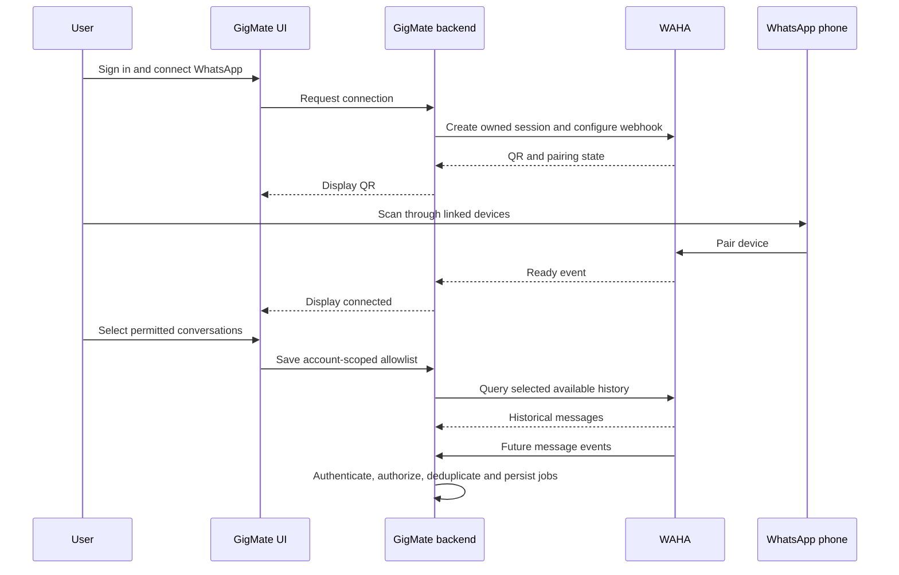

# Connecting WhatsApp and receiving messages through WAHA

Updated: 2026-10-02. This describes planned product/technical behavior, not implemented live access. The repository remains v0.2 synthetic replay. Provider APIs were checked against official documentation; implementation must pin and test the actual version/engine. See [Role A responsibilities](role-a-responsibilities.md), [roadmap](role-a-development-roadmap.md) and the [Chinese counterpart](../zh/whatsapp-connection-flow.md).

## User flow and identities

Planned flow: sign into GigMate → connect WhatsApp → scan QR on the phone → wait for readiness → select permitted customer conversations → synchronize available history and future messages.

GigMate login establishes product identity and permissions. WhatsApp pairing links a server-side WAHA session as an associated device. These are separate authentications; pairing and allowing GigMate to analyze selected conversations are also separate decisions. WAHA runs on our server and exposes one connection as a session.



## Session creation and QR

After product authentication, the backend creates a WAHA session and persists a trusted mapping: GigMate account → WAHA instance/session → WhatsApp account. Check the connected account after pairing and enforce ownership on every request; body account_id or session names are not authorization.

Provider API examples:

```http
POST /api/sessions
GET /api/{session}/auth/qr
```

Configure our webhook on the session. The UI gets QR/status through GigMate, without WAHA API keys or connector administration access. These are provider endpoints, not implemented GigMate routes. Users scan through WhatsApp's linked-device flow. WAHA also supports pairing codes, but QR is the path described here. Refresh QR on each SCAN_QR_CODE notification and show connected only after WORKING; handle expiration, FAILED and possible extra authentication states. Scanning alone is not success. [WAHA Sessions](https://waha.devlike.pro/docs/how-to/sessions/)

Provide QR temporarily to its owner, never logs/repository. Keep persistent session credentials private on the server. Map provider states into domain connection semantics with freshness; do not silently reinterpret existing enums.

## Conversation selection

Expose only the minimal conversation metadata needed for authorized selection, enforce ownership, and persist the selected allowlist. Do not pre-store every message to build a selector. Unselected business content must not enter GigMate storage, logs or AI.

The allowlist is application filtering, not per-chat WhatsApp device permissions: WAHA may receive other conversations. Review provider storage/media/logging/retention separately; do not claim pairing accesses only selected chats. Allowlist removal or consent revocation also requires rechecking queued processing and external execution.

## Live events and durable processing

Webhook means WAHA notifies our backend when something changes. Message/edit/revoke/ack events are available; message.any includes outgoing messages. Test subscriptions and mappings against the pinned engine and deduplicate overlapping event subscriptions. [WAHA Receive messages](https://waha.devlike.pro/docs/how-to/receive-messages/)

Backend sequence: authenticate webhook → trusted session/account mapping → consent/allowlist → normalize/validate → atomically deduplicate, persist source revisions, advance context, invalidate stale proposals and create job → acknowledge after commit → worker processing. WAHA supports webhook HMAC configuration; this authenticates inbound notifications and is separate from the API key used for backend-to-WAHA calls. [WAHA Security](https://waha.devlike.pro/docs/how-to/security/)

A owns reliable reception; B generates sourced proposals; C owns merchant confirmation/formal writes; D presents results. Accepted input is not confirmed business state. Future API echoes advance context without reply loops or retroactive cancellation of dispatched sends.

## Historical messages and recovery

| Data | Access | Requirements |
| --- | --- | --- |
| Future messages | Webhooks | Durable reception, deduplication and provenance |
| Earlier history | Backend queries available WAHA records | Authorized conversations and bounded range only |
| Disconnect gaps | Tested lookup/backfill or manual reconciliation | Never assume full recovery capability |

Provider example:

```http
GET /api/{session}/chats/{chatId}/messages?limit=100&downloadMedia=false
```

Pagination/time filters support initial sync and reconciliation; encode path identifiers correctly. Avoid constant history polling instead of live events. [WAHA Chats](https://waha.devlike.pro/docs/how-to/chats/)

Successful pairing does not guarantee all phone history. Engine/sync/configuration affect availability. NOWEB disables chat storage by default; configure store before relying on history endpoints and decide relevant settings before pairing. Published sync ranges are not our tested guarantees. [NOWEB Store](https://waha.devlike.pro/docs/engines/noweb/)

Historical imports and live events share persistent message identity/deduplication. Historical snapshots do not establish complete edit/revoke revision chains; do not invent missing provenance. Reconcile the initial-sync/live boundary and prevent old snapshots overwriting current revisions. Agree historical proposal behavior with B/C before enabling it, including avoiding bulk stale proposals.

## Delivery and acceptance

A delivers session ownership, QR/status services, allowlist integration, adapters, durable reception/jobs and history/reconnect capability evidence. D supplies UI; C coordinates identity/transactions/approvals; B input/provenance; E failure acceptance.

Complete as many related implementation, migration, generated-contract, test and bilingual-document tasks as practical within the authorized batch before unified acceptance. Cover isolation, QR expiry/refresh, connection failure, forged webhook, no storage of unselected content, history/live duplicates and ordering, revoked consent, restart and reconnect. Live QR, chat selection, history import and provider webhook remain unimplemented; replay cannot establish them.
