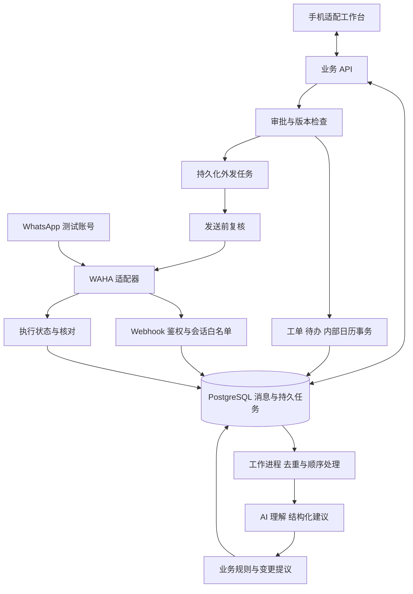

# 跟單项目工程启动与多人协作计划书

> 本文件保留为早期规划提案。当前工程规则以 [英文基线入口](en/README.md)、[中文内部入口](zh/README.md)、已接受 ADR 和 [契约](../contracts/README.md) 为准；本文的五人分工与建议安排不代表当前团队或已完成实现。

编制日期：2026年10月1日  
适用范围：五人团队从当前仓库启动原型开发，并为后续扩展建立统一标准。  
方案依据：仓库中的《跟單 WhatsApp 业务协作助手 新版方案 v2》。

## 1 核心建议

第一步建议开展一个三天的工程启动阶段，形成“可以运行并可供团队共同遵守的工程基线”。它包括首期业务闭环、真实消息接入验证、领域与状态模型、接口契约、开发骨架和协作流程。三天是工作量目标，接入测试账号、团队投入时间或开发环境不足时应调整。

启动阶段结束后，前端、消息接入、AI 与业务后端应能围绕同一组数据和接口独立推进，每天在同一环境联调。统一标准的重点是业务含义和执行规则，目录与代码风格用于支持这些规则。

目前仓库只有一行 README、通用 Python .gitignore 和方案文件，尚无应用代码、依赖清单、数据库迁移或开发环境配置。README 中仍使用 GigPair 及人才配对定位，与新版方案的业务协作定位不同。启动时应统一产品名称与工程标识，避免后续成员沿用旧方向。

本计划中的技术选型、目录、接口与工期均为建议，尚未实施。先按团队已有经验确认一次，再记录为架构决策；不依据 .gitignore 推断团队已选择 Python。

## 2 首期业务闭环和范围

所有模块首先服务同一个可验收场景：

> 顾客提出改期并缺少地址 → 自动接收双方消息 → 关联已有工单 → 显示待确认变更及原文 → 检测新时间冲突 → 商户批准澄清消息 → 顾客回复 → 商户确认正式改期 → 更新工单、待办、内部日历和旧提醒 → 可核对执行结果。

这条流程直接使用原方案的改期场景作为共同样例。另准备同客多单、含糊回复、重复事件和断线场景，防止团队只围绕一个成功案例实现。

| 范围 | 首期处理方式 | 完成依据 |
| --- | --- | --- |
| 双方文字消息与连接状态 | P0 | 真实消息自动进入，断线可见 |
| 工单归属与需求变更 | P0 | 不确定归属进入人工队列，保留新旧值和来源 |
| 待确认队列与逐条批准 | P0 | 未确认提议不覆盖正式承诺 |
| 待办与内部日历 | P0 | 区分预约、截止日期和暂定安排 |
| 冲突检查与批准代发 | P0 | 后端复核权限和版本后执行 |
| 语音或图片、每日摘要、预授权提醒 | P1 | 主线验收后逐项加入 |
| 外部日历、付款辅助、知识库、群聊 | 后续 | 各自有单独契约和验收案例 |

初期为一位经营者管理个人业务，但从第一版保留账号隔离。开发团队多人协作与产品内员工协作是不同需求；不因此增加轮班、复杂组织权限或群聊协作。

## 3 必须先统一的业务规则

### 3.1 统一实体及含义

| 实体 | 责任与关系 |
| --- | --- |
| AccountConsent | 商户账号、处理授权、会话白名单及撤销状态 |
| Conversation | 一个聊天会话，可关联多个工单 |
| ConversationMessage | 消息身份、方向、发送与接收时间、修改版本和来源 |
| WorkOrder | 一项业务的已确认记录、待决变更和业务版本 |
| RequirementChange | 字段新旧值、提出者、确认状态和来源消息 |
| Task | 待办负责人、截止时间、依赖和来源 |
| CalendarEvent | 正式或暂定排期、起止时间或全天日期、时区和缓冲 |
| ApprovalAction | 待批准内容、收件人、版本快照、审批与执行结果 |
| AuditLog | 谁在何时做了什么、关联记录及执行依据 |

建议将原方案的 TaskCalendarEvent 拆成 Task 和 CalendarEvent，把审计与附件也分别建模。待办、排期、附件的生命周期不同；首期附件仅预留关联方式。

每个业务实体必须有稳定 ID、所属账号和必要的版本信息。联系人不能直接作为工单 ID；会话与工单使用显式关联关系。跨账号查询和写入必须在后端校验。

重要需求字段采用“值、确认状态、来源消息、解析依据”的结构。日期缺失保留 null；只有日期的交付期限使用日期类型；明确时刻保存 UTC 时刻和 IANA 时区。默认业务展示时区按方案设为 Asia/Hong_Kong，并允许账号设置；不得根据开发机器时间解释“星期四”。

### 3.2 统一三种状态

需要区分业务状态、字段确认状态、行动执行状态。例如工单可以处于执行中，同时新时间字段仍待确认，澄清行动仍待审批。

- 业务状态：待归类、待确认、已确认、执行中、等待顾客、已完成、已取消。
- 字段状态：缺失、提出、已确认、需复核。
- 行动状态：草稿、待审批、已批准、执行中、成功、失败、结果未知、已取消、已过期。

状态文档必须说明允许的转换、操作者、条件和副作用。例如顾客提出改期只新增提议；正式改期要经过商户批准；来源撤回使相关字段和审批进入复核，不自动删除所有业务记录。顾客确认与商户批准不能用同一个 confirmed 标记代替。

### 3.3 统一审批和执行规则

审批绑定具体行动、收件人、正文、工单版本、相关会话上下文版本和有效期。执行前后端重新检查账号授权、连接状态、最新消息、任务取消状态和审批快照。即使最新消息还没被 AI 处理，也必须能阻止依据旧上下文发送。

首期采用保守规则：相关会话有新消息、相关来源修改或撤回时，待执行审批进入复核；后续再优化为按字段依赖精准失效。商户编辑正文后需要重新确认该快照。

“连接器接受发送”“送达”“顾客确认需求”分别记录。请求超时且无法判定发送结果时进入结果未知，核对后再处理，不直接自动重发。应用幂等记录不能保证第三方发送接口具备恰好一次语义。

## 4 建议架构

### 4.1 部署形态

建议采用单仓库、模块化单体后端、独立工作进程。模块可以由不同成员负责，API 和工作进程复用同一套业务代码和数据库迁移。



AI 只输出建议，不直接写业务表、创建正式排期或持有 WhatsApp 发送凭据。日期计算、冲突检测、权限校验与状态转换由确定性代码负责。前端调用业务 API，不接触 WAHA 管理接口。

### 4.2 技术栈建议

| 层 | 默认建议 | 选用理由 |
| --- | --- | --- |
| 工作台 | React + TypeScript + Vite | 首期工作台可采用简单客户端应用，建立类型和组件规范 |
| 后端 | Python + FastAPI + Pydantic | 结构校验与 OpenAPI 契约便于 AI 和前端协作 |
| 数据库 | PostgreSQL | 统一保存业务、审批、任务和审计，并使用事务与唯一约束 |
| 迁移 | SQLAlchemy + Alembic | 变更通过版本化迁移复现 |
| 异步处理 | 同一代码库的 worker，首期 PostgreSQL 持久任务表 | 降低初始组件数量，保证重启后任务仍可核对 |
| 接入 | 固定版本与引擎的 WAHA adapter + Replay adapter | 分离供应商负载与内部业务协议，支持可重复测试 |
| 本地环境 | Docker Compose，提供无真实账号的回放模式 | 团队成员可使用相同数据库和服务配置 |

技术负责人在第一天按团队经验确认选型。如果团队主要熟悉 TypeScript，可选择 TypeScript 后端；统一领域规则和契约仍然必需。首期不增加微服务、Kubernetes、向量数据库或复杂多 Agent 调度。任务规模上升或已有成熟队列经验时，再决定引入 Redis 和具体队列实现。

FastAPI 官方文档说明其支持 OpenAPI 与基于 Pydantic 的数据处理，适合上述契约生成方式。[FastAPI Features](https://fastapi.tiangolo.com/features/)

### 4.3 模块边界

| 模块 | 负责 | 对外提供 |
| --- | --- | --- |
| identity | 登录、账号隔离、授权、会话白名单 | 当前账号上下文与权限判断 |
| messaging | 连接器、消息归一化、同步状态与去重 | 统一消息事件与来源查询 |
| understanding | 工单归属建议、需求抽取、澄清草稿 | 通过 schema 校验的提议 |
| workorders | 工单、需求变更、确认与历史 | 业务查询和版本化命令 |
| planning | 待办、内部日历、冲突检查 | 排期建议和批准后的更新 |
| actions | 审批、失效、外发与结果核对 | 行动状态和执行入口 |
| audit | 审计、追踪与删除流程 | 可核对的操作链 |

每个模块有主负责人，关键规则有交叉审核人。跨模块通过明确的应用服务接口协作，不在不同模块中各自实现另一套工单状态或审批规则。

### 4.4 持久化与并发原则

Webhook 通过鉴权及白名单过滤后，先将允许的消息事件和处理任务可靠落库，再返回成功响应。唯一约束区分事件身份与消息身份，不能把修改、撤回事件当作重复原始消息丢弃。

同会话处理采用串行任务或数据库锁，工单写入带 expected_version。旧版本写入返回冲突，前端提示重新核对；延迟到达的事件不靠接收时间直接覆盖已确认记录。多成员不得各自设计不兼容的锁和重试策略。

工单变更、内部日历、待办和旧提醒撤销应在数据库事务中协调。对外发送使用事务性 outbox：审批状态及待发任务共同提交，工作进程再执行。任务需要领取租约、重启恢复、次数限制、失败记录与人工处理入口；外发结果未知采用专门核对流程。

## 5 团队共同遵守的契约

### 5.1 API 与事件

使用 /api/v1 作为业务 API 前缀。统一 UUID、分页、时间表示、错误码及 request_id。变更接口提交 expected_version；权限身份取自服务端登录上下文，不信任浏览器自行传入的 account_id。

至少先定义工单列表与详情、变更提议、审批与拒绝、待办、日历、会话时间线、连接状态八组接口。审批与外发分离，浏览器不能提交任意文本绕过审批直接调用连接器。

统一消息事件至少包含：schema_version、event_id、event_type、account_id、connector、session_id、conversation_id、provider_message_id、occurred_at、received_at、direction、source、message_revision 及规范化 payload。字段映射和唯一键必须经过所选 WAHA 引擎实测。

WAHA 官方事件文档提供消息、状态等事件说明，但不同引擎能力应单独核验。[WAHA Events](https://waha.devlike.pro/docs/how-to/events/)

后端 Pydantic 模型作为 API schema 的唯一来源，导出版本控制中的 OpenAPI，再生成前端类型。AI 输出 schema 单独定义并与领域类型显式映射；不要让模型输出结构自动成为数据库结构。CI 检查契约变更与生成文件是否同步。

### 5.2 AI 输出和评测

模型输出统一为工单归属候选、字段变更、确认状态、来源消息、未决问题、沟通草稿和不确定性说明。模型输出必须经过结构及语义校验；不存在的来源、非法日期、越界工单和不支持的行动进入异常或人工队列。

提示词、模型标识、参数、schema 和评测集版本一并记录。前端围绕统一样例开发，模型实现使用同一 schema。初期使用固定输出桩验证业务链，再切换真实模型；记录真实模型结果与桩结果的区别。

第一天准备至少 10 个虚构的共同验收案例。完整开发评测按原方案扩展为 30 至 50 条开发案例及至少 20 条独立保留测试案例；含糊确认和业务归属由两人标注，记录分歧。测试集与演示、调提示样例分别管理。

## 6 建议仓库结构与协作规则

```text
apps/
  web/                         前端工作台
  backend/
    src/
      modules/                 上述业务模块
      adapters/                WAHA Replay 模型服务
      shared/                  数据库 配置 追踪 公共错误
      api/                     HTTP 入口
      worker/                  持久任务入口
    migrations/
    tests/
contracts/
  openapi.json                 从后端导出
  events/                      内部事件 schema
  ai/                          模型输出 schema
  examples/                    前后端与回放共同样例
evals/
  development/
  holdout/
infra/
  compose.yaml
scripts/
docs/
  product-scope.md
  architecture.md
  domain-model.md
  workflows.md
  development.md
  acceptance.md
  adr/                         架构决策记录
.github/
  workflows/
  ISSUE_TEMPLATE/
  pull_request_template.md
README.md
AGENTS.md
.env.example
```

这是一份待建设的目录建议，不要求启动阶段填满空目录。上面的六份基础文档可以先用短文档建立规则，后续通过 PR 演进。

README 是唯一入门入口，说明项目定位、前置条件、启动、回放、测试和常见问题。AGENTS.md 规定自动编码工具应遵守的模块边界、验证命令和凭据处理规则；团队协作方式在 development.md 中说明。

协作采用以下规则：

1. main 保持可运行；短期 feat、fix、docs 分支通过 PR 合并，至少一人审核。配置可用的 CI 和分支保护，不等待全部功能完成。
2. 每个任务写明场景、模块、接口依赖、验收案例和负责人。任务拆到通常一天内可交付，不让一人长期在独立分支实现整个子系统。
3. 数据库迁移、共享 schema、状态转换和核心依赖变更，由技术负责人组织相关模块负责人复核。已共享应用的迁移通过新迁移修正。
4. 每天固定联调，展示从消息到行动的整条链，记录阻塞；对照共享契约定位问题。
5. 格式化、lint、类型检查、契约一致性和关键测试进入 CI。新功能至少验证权限、正常路径和相关异常路径，不以只有页面截图作为完成证明。
6. .env.example 仅放变量名和假值；真实密钥、会话缓存、QR 码、聊天内容、数据库导出不进入仓库。统一时区、日志字段、错误码和命名规则。
7. 代码完成包括文档、迁移、适当测试和联调证据；PR 描述说明触发条件、结果行为、验证与已知限制。

## 7 三天启动安排

以下按 10月1日至3日且成员可同步投入安排；若实际开始时间不同，整体顺延并重新评估后续范围。

| 时段 | 工作 | 负责人 | 必须交付 |
| --- | --- | --- | --- |
| 第一天上午 | 定业务闭环、P0、术语和验收样例；确认技术栈 | C 牵头，全员参与 | 范围页、状态草案、10 个验收案例、首份 ADR |
| 第一天全天 | WAHA 扫码、双方收发、断线和回执实测 | A 与 E | 固定版本和引擎、字段样本、能力与缺口记录 |
| 第一天下午 | 领域 schema、消息事件、接口样例、页面流程 | B C D | 数据关系图、schema 草案、统一 JSON 样例 |
| 第二天 | Compose、迁移、API、worker、回放、前端壳、CI | A C D；B 提供抽取桩 | 一条命令启动、健康检查、来源消息与待确认卡 |
| 第二天同步 | AI 样例标注与关键规则测试 | B E | 初始评测集、重复/过期/越权测试 |
| 第三天 | 贯通最小链、真实接入复核、新成员启动演练 | 全员 | 工程基线 v0.1、测试结果、可分配任务清单 |

第三天最小链为：回放或真实消息进入 → 固定抽取桩形成变更提议 → 工作台展示原文 → 商户确认 → 数据持久化 → 生成并批准发送行动 → adapter 返回执行结果。真实模型、多场景冲突策略和完整页面在后续实现。真实 WhatsApp 收发证据必须单独验收，回放不能替代。

WAHA 接入出现重大阻塞时，保留回放供内部研发，同时把真实接入标为未通过；由团队决定调整接入方式、账号条件或项目承诺，并评估剩余时间。原方案指出的接入风险也得到 WAHA 官方免责声明支持：该项目并非 WhatsApp 官方授权，不能保证账号不被停用。[WAHA Introduction](https://waha.devlike.pro/docs/overview/introduction/)

WAHA 管理 API 应限制在私有网络，Webhook 按选定版本支持的认证或签名方式校验。官方安全文档同样建议不要将其 API 暴露到公共网络。[WAHA Security](https://waha.devlike.pro/docs/how-to/security/)

## 8 五人分工与依赖

| 成员 | 主责任 | 关键输出 | 交叉协作 |
| --- | --- | --- | --- |
| A | 接入、基础环境、事件持久化与监控 | WAHA 与 Replay adapters、连接状态、部署配置 | 与 C 统一去重和任务机制，与 E 做接入异常测试 |
| B | AI 抽取、提示词、输出校验与评测 | 结构化建议、模型运行记录、错例 | 与 C 统一业务状态，与 D 统一提议展示 |
| C | 技术统筹、业务模型、审批、待办与日历 | schema、状态机、事务和执行规则 | 组织架构审核，优先完成公共接口避免阻塞他人 |
| D | 工作台、移动端体验与生成类型 | 时间线、待确认队列、日历、错误状态 | 使用契约样例并行开发，与 E 做用户任务测试 |
| E | 用户研究、验收、异常测试和演示证据 | 访谈记录、测试集、缺陷、演示材料 | 从第一天参与标注与规则验收 |

C 的职责较集中，需把具体 API 和测试分给 A、B 等成员协助，避免成为所有模块的唯一交付人。技术负责人是协调职责，不要求所有 PR 只由一人审核。

可立即拆分的首批任务：真实文字接入验证、统一消息 schema、工单与变更 schema、审批状态机、10 个验收样例、回放工具、开发环境、工作台待确认页、schema 生成与 CI。任务依赖写入 Issue，前端和 AI 可以先用样例与桩推进。

## 9 启动阶段验收门槛

工程基线 v0.1 至少满足：

- 另一位成员按 README 从全新 checkout 启动回放环境，建议目标为前置依赖齐备后 30 分钟内成功；配置凭据后能切换测试接入。
- 真实账号收发双方文字并记录可核对消息 ID、时间及连接状态，确认版本与引擎；建议至少 50 条消息加重复事件进行受控验证。
- 前端、抽取桩和后端使用同一套示例，接口错误、版本冲突和待确认状态表现一致。
- 重复消息不重复创建业务记录；修改和撤回能进入复核；同一顾客两单不被自动合并。
- 未批准不能发送；修改正文或相关上下文后旧批准不能执行；断线和结果未知不会触发盲目重发。
- 非白名单会话不进入业务持久化、模型输入和内容日志。连接器可能接触未选会话的边界在接入说明中明确。
- 两个测试账号不能相互读取或修改记录；后端鉴权覆盖业务 API。
- 工单、任务、排期及执行状态重启后保留，出现失败能找到所属行动和来源，不以 UI 临时状态作为事实来源。
- CI 能拦截不符合类型、schema 或关键业务规则的修改，main 可启动并演示最小链。
- 六份基础文档、开发入口、任务清单和架构决策有负责人维护。

启动验收与完整 P0 验收分开。固定抽取桩贯通仅证明工程链路；真实模型准确率、完整改期冲突逻辑和真实用户效果在后续阶段评测。

## 10 后续交付节奏

沿用原方案的内部开发节奏：10月4日至7日实现真实抽取、工单、待确认界面和内部日历；10月8日至11日贯通完整改期冲突、审批发送及状态核对；10月12日至14日执行用户任务测试、保留集评测和异常修复；10月15日至16日冻结 P0，准备演示证据。比赛提交日期和材料要求以主办方通知为准。

增强功能只有在 P0 主线和权限验收通过后加入。10月7日前工程进度不足时优先暂停媒体、摘要和预授权提醒；10月11日前真实闭环未通过时集中处理接入和执行问题。不要以模拟成功记录替代真实连通结果。

长期扩展保持三个条件：新模块通过已有应用服务接口连接；新增实体和状态经过 schema 与迁移评审；新增外部写入复用审批、幂等和结果核对机制。由此逐步支持媒体、外部日历、模板、周期业务与付款辅助，不必重写整个核心。

## 11 第一次团队会议应形成的决定

建议安排 90 分钟启动会议，使用本计划的主线和样例，依次形成四项决定：首期验收流程；实际采用的技术栈和测试账号条件；消息、工单与审批的核心字段和状态；三天交付物的负责人及验收人。

会议结束后立即发布首批 Issue、启动接入验证，并提交范围、领域模型和接口样例的第一版 PR。工程基线通过验收后，团队再围绕统一契约展开完整 P0 开发。

第一步的完成标志是：一名新成员能够启动环境、理解一条业务如何变化、按明确接口实现自己的模块，并通过共同测试证明它能接入主线。
