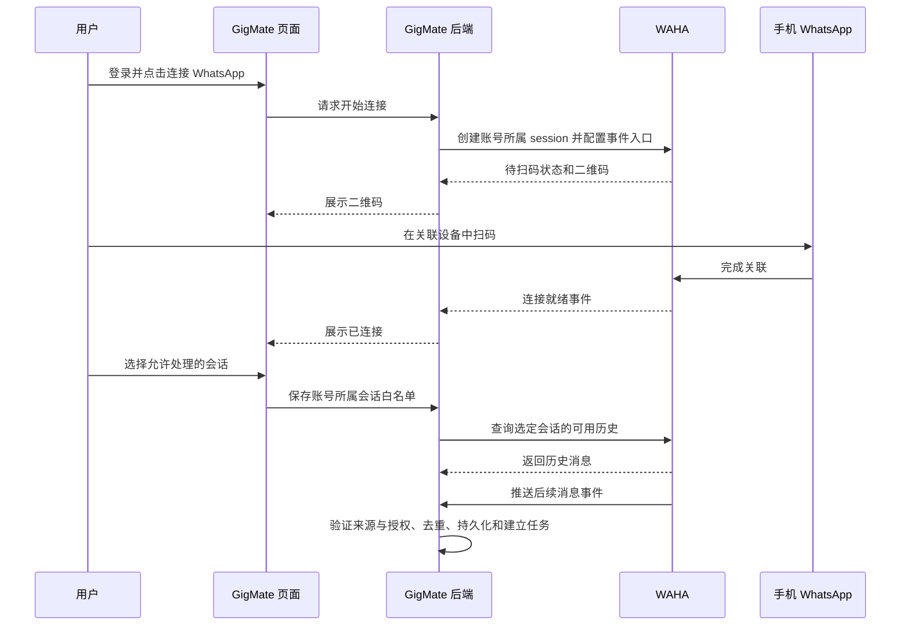

# 用户如何连接 WhatsApp，以及 WAHA 如何获取消息

更新：2026-10-06。下文前端流程与历史同步为产品目标；本地 CLI 扫码/选择、WAHA 持久文字接入/监控已经实现，历史工具仅统计可用记录，不导入正文。见[当前能力总览](role-a-waha-handoff.md)、[A 的职责](role-a-responsibilities.md)、[开发演进](role-a-development-roadmap.md)和[英文对应说明](../en/whatsapp-connection-flow.md)。实际能力以已测试版本/引擎和证据为准。

## 1. 用户看到的操作

计划流程：登录 GigMate → 点击“连接 WhatsApp” → 用手机扫码 → 等待连接就绪 → 选择允许处理的客户会话 → 同步可用历史和后续消息。

GigMate 登录确定产品账号与权限；WhatsApp 扫码把服务器上的 WAHA session 关联到用户的 WhatsApp。两者不是同一次登录。WAHA 是运行在服务器上的连接服务，session 可以理解为一条独立的 WhatsApp 连接。关联设备与允许 GigMate 分析哪些会话也分别授权。



## 2. 后端创建连接，前端展示二维码

后端验证当前产品用户后调用 WAHA 创建 session，并保存可信对应关系：GigMate account → WAHA instance/session → WhatsApp account。真实账号信息在连接后核对；不能只靠请求体的 account_id 或 session 名称判定归属。每个请求都检查连接是否属于当前用户。

官方接口示意：

```http
POST /api/sessions
GET /api/{session}/auth/qr
```

session 创建时配置我们的 Webhook 地址。前端通过 GigMate 后端获得二维码和状态，不直接持有 WAHA API 密钥或调用连接器管理接口。这些是供应商接口，不是当前 GigMate 已实现的路由。[WAHA Sessions](https://waha.devlike.pro/docs/how-to/sessions/)

用户在手机 WhatsApp 的“关联设备”中扫码。WAHA 支持二维码或配对码认证；本产品先描述二维码路径。每次收到 SCAN_QR_CODE 状态要获取新的二维码。只有确认 session 到达 WORKING 才显示连接就绪；二维码过期、FAILED 和可能的额外认证步骤需要单独处理，不能把“已扫码”直接当成功。[WAHA 扫码与状态](https://waha.devlike.pro/docs/how-to/sessions/)

二维码只临时提供给所属用户，不写日志或仓库；session 登录状态在服务端私有持久化。WORKING 是 WAHA 状态，映射为项目连接状态时还要考虑新鲜度，不直接改动现有枚举含义。

## 3. 连接以后选择会话白名单

产品计划只展示完成选择所需的最少会话信息，由用户选择工作相关客户或群聊，并在后端保存白名单。未入选会话正文不能进入 GigMate 业务存储、日志或 AI。列表获取也需核对用户授权与账号归属，不能为选择会话提前保存所有消息。

这是应用侧的处理限制，不是 WhatsApp 设备关联的逐会话权限：WAHA 本身可能接收到其他会话内容。需要单独检查 WAHA 的消息存储、媒体下载、日志和保留配置，不能宣传“只关联了选中的会话”。移除白名单或撤销授权后，新的处理任务和外部执行也必须复核。

## 4. 新消息：WAHA 主动通知后端

Webhook 就是有变化时 WAHA 主动向我们的接口发送通知。官方支持消息、修改、撤回、回执等事件；message.any 包括自己发送的消息。具体订阅与映射按固定引擎实测，避免同时订阅重叠事件导致重复处理。[WAHA 接收消息](https://waha.devlike.pro/docs/how-to/receive-messages/)

后端顺序：验证 Webhook 来源 → 可信 session/account 映射 → 授权/白名单 → 转换并校验标准事件 → 事务内去重、保存消息来源版本、推进 context_version、使旧提议失效并创建 Job → 提交后确认接收 → Worker 处理。

WAHA 支持 Webhook HMAC 配置，使用固定版本支持的机制验证通知来源；这与后端调用 WAHA 时使用的 API 密钥鉴权不同。[WAHA Security](https://waha.devlike.pro/docs/how-to/security/)

例如，客户说“改到周四下午”：A 负责可靠接收这条消息，B 负责生成有来源的提议，C 负责商户确认与正式写入，D 负责展示。接收成功不是业务确认。未来 API 自发消息回显需要更新上下文，但不得循环回复或追溯取消已派发发送。

## 5. 历史消息：另外查询可用记录

| 内容 | 方式 | 项目要求 |
| --- | --- | --- |
| 后续新消息 | Webhook 推送 | 可靠接收、重复处理和来源版本校验 |
| 连接前历史 | 后端查询 WAHA 可用记录 | 用户授权后仅查询允许的会话和范围 |
| 断线遗漏 | 按实测能力查询补取或人工核对 | 不假定平台一定支持完整补取 |

官方按会话查询示例：

```http
GET /api/{session}/chats/{chatId}/messages?limit=100&downloadMedia=false
```

接口提供分页与时间过滤，chatId 等路径值需要正确编码。历史查询用于首次同步和核对，不用持续轮询替代实时事件。[WAHA Chats](https://waha.devlike.pro/docs/how-to/chats/)

扫码成功不保证能读取手机上的全部历史；范围取决于引擎、同步状态和配置。例如 NOWEB 默认不启用聊天存储，读取相关历史接口前需要配置 store，且应在扫码前确定相关配置。官方描述的同步范围不能替代我们固定版本的实测结论。[NOWEB Store](https://waha.devlike.pro/docs/engines/noweb/)

历史导入还需与实时事件共用消息身份映射和去重；历史快照并不自动包含完整编辑/撤回版本链，缺失来源不能猜测。首次同步同时收到实时消息时须核对边界，旧快照不能覆盖新修订。是否允许历史输入生成业务提议及如何防止批量过期提议，与 B/C 先约定。

## 6. A 的交付与统一验收

A 提供 session 绑定、扫码/连接状态接口、白名单衔接、供应商事件适配、可靠存储/任务、历史查询和断线能力验证；D 配合连接页面，C 配合归属/事务/审批规则，B 配合输入和来源，E 组织异常验收。

按已授权批次尽可能完成相关实现、迁移、契约生成、测试和中英文文档后统一验收。需要测试：账号隔离、二维码更新/过期、连接失败、非法 Webhook、未入选消息不落库、历史与实时重复/乱序、撤销授权、重启和断线恢复。当前二维码、会话选择、历史导入与真实 Webhook 均未实现，不能拿回放结果当真实通过。
